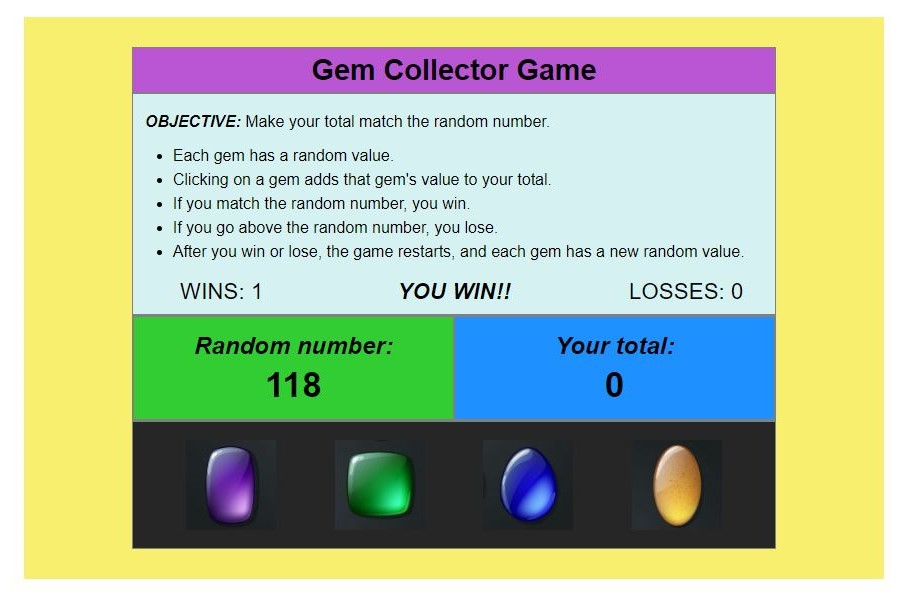

# Gem Collector Game

### A simple number game 
- at the start of each game, each gem is assigned its own random value (between 1 and 12)
- when a player clicks on a gem, its value gets added to the player's total
- players need to choose the right combination of gems to make their total match the random number chosen by the game

### Notes about the program
- written with HTML, CSS, and JavaScript
- mobile responsive
 

--------------------------------------------------

## Game screen shot:

### Link to play:
https://ljelias.github.io/unit-4-game/
